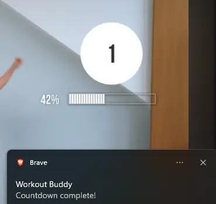

# Workout Buddy

Mute the music of your favorite workout video without skipping a rep—play yours instead. Workout Buddy uses on-device vision language models to monitor the video and send instant reminders to switch exercises or take a break. Next.js rewrite of my original, rusty [Workout Buddy](https://github.com/mrrfv/workout-buddy).

## Features

- Video-agnostic. It works with almost any YouTube video, as long as it contains a countdown timer
- Ignores irrelevant scenes (e.g. other tabs, windows)
- Runs entirely in-browser, doesn't permanently store screen captures
    - Works cross-platform
    - You can share only the YouTube tab with the model for better privacy
- Communicates with the AI provider of your choice
    - Ollama
    - OpenRouter
- Works great with the smallest vision language models, like Ministral 3 3B
    - Analyzes 3 screenshots at once, allowing the model to find less obvious timers
- Plays an audible sound with a notification when the countdown is over

## Running locally

The app at `web/` is a standard Next.js project. To run it locally, run `pnpm install` and `pnpm dev` inside the folder.

## Why not OCR?

I realized early on that this problem could've been solved with OCR. However, using a vision language model removes the friction of having to manually point the engine to the timer's location on the screen. A model can automatically find and interpret the timer, regardless of its position or style. This makes the app much more user-friendly.

## License

AGPL-3.0 License. See [LICENSE](./LICENSE) for details.
